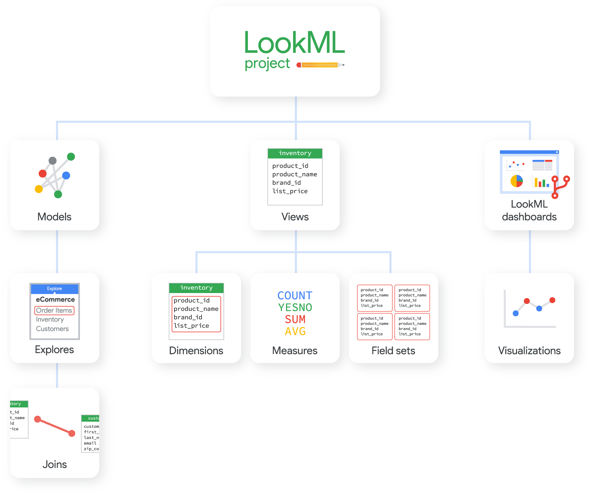
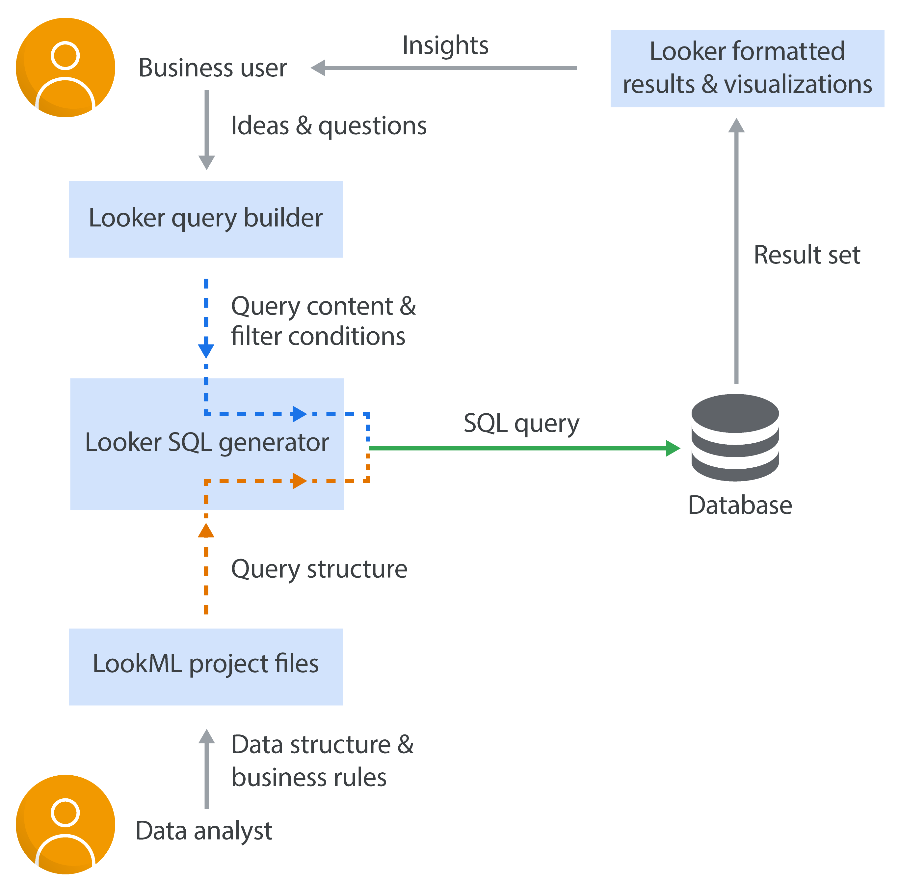

# LookMLとは?
LookMLはSQLデータベース内のディメンション、集計、計算、およびデータ関係を記述するための言語です。LookerはLookMLで記述されたモデルを使用して、特定のデータベースに対するSQLクエリを作成します。

# Lookerの構成


上図がLookerの各コンポーネント間関係性を表現しています。

# LookMLプロジェクト
LookMLプロジェクトとは、Gitリポジトリを介してバージョン管理を一括で行うことの多いモデル、ビュー、ダッシュボートのファイルを集めたものです。モデルファイルには、使用するテーブルと結合の方法に関する情報が含まれています。ビューファイルには、各テーブル（あるいは、結合により許可されている場合には複数のテーブル）の情報をどう計算すべきかについての情報が含まれています。

下図のようにLookMLのファイルは完全に切り離されているため分析者が構築するプロジェクトと公開されるものは独立した状態となっています。



LookMLプロジェクトは、一連の関連するモデル、ビュー、Explore、および（オプションとして）LookMLのダッシュボードを記述するLookMLファイルの集まりです。

LookMLプロジェクトには通常、次の構造体が含まれます。

- モデルには、使用するテーブルとテーブルの結合方法に関する情報が含まれます。モデルでは通常、モデルとモデルのExploreおよびjoinを定義します。
- ビューには、各テーブルの（または複数の結合されたテーブル全体の）情報へのアクセス方法や計算方法に関する情報が含まれます。通常、ビュー、ビューのディメンションとメジャー、フィールドセットを定義します。
- Exploreはよくモデルファイル内で定義されますが、ネイティブ派生テーブル用にExploreファイルが別途必要になったり、Exploreを複数のモデルに拡張するまたはリファインすることが必要になる時もあります。
- joinによって複数のビューのデータを1つに統合します。
- マニフェストファイルには、別のプロジェクトからインポートしたファイルの使用や、プロジェクトのローカライズ設定に関する指示が含まれる場合があります。


# Lookerによって生成されるSQLクエリ
データ分析のために、LookMLではDRY原則（Don’t Repeat Yourself）に基づくスタイルを促進しています。つまり、ある箇所に1回SQL式を書けば、Lookerがこのコードを使ってその場に応じたSQLクエリを繰り返し生成していくのです。ビジネスユーザーはこの結果、複雑なクエリをLooker内で構築することが可能になります。SQL構文の複雑さに煩わされることなく、必要なコンテンツだけに集中することができます。

GUIベースで様々なクエリの構築が可能なため複雑なSQLの理解する必要がないです。

LookML自体は従属言語で命令型言語と違う性質を持ちます。

以下がコード例になります
```
######################################
# FILE: ecommercestore.model.lkml    #
# Define the explores and join logic #
######################################
connection: order_database
include: "*.view.lkml"
explore: orders {
  join: customers {
    sql_on: ${orders.customer_id} = ${customers.id} ;;
  }
}

##########################################################
# FILE: orders.view.lkml                                 #
# Define the dimensions and measures for the ORDERS view #
##########################################################
view: orders {
  dimension: id {
    primary_key: yes
    type: number
    sql: ${TABLE}.id ;;
  }
  dimension: customer_id {      # field: orders.customer_id
    sql: ${TABLE}.customer_id ;;
  }
  dimension: amount {           # field: orders.amount
    type: number
    value_format: "0.00"
    sql: ${TABLE}.amount ;;
  }
  dimension_group: created {                # generates fields:
    type: time                              # orders.created_time, orders.created_date
    timeframes: [time, date, week, month]   # orders.created_week, orders.created_month
    sql: ${TABLE}.created_at ;;
  }
  measure: count {             # field: orders.count
    type: count                # creates a sql COUNT(*)
    drill_fields: [drill_set*] # list of fields to show when someone clicks 'ORDERS Count'
  }
  measure: total_amount {
    type: sum
    sql: ${amount} ;;
  }
  set: drill_set {
    fields: [id, created_time, customers.name, amount]
  }
}

#############################################################
# FILE: customers.view.lkml                                 #
# Define the dimensions and measures for the CUSTOMERS view #
#############################################################
view: customers {
  dimension: id {
    primary_key: yes
    type: number
    sql: ${TABLE}.id ;;
  }
  dimension: city {                    # field: customers.city
    sql: ${TABLE}.city ;;
  }
  dimension: state {                   # field: customers.state
    sql: ${TABLE}.state ;;
  }
  dimension: name {
    sql: CONCAT(${TABLE}.firstname, " ", ${TABLE}.lastname) ;;
  }
  measure: count {             # field: customers.count
    type: count                # creates a sql COUNT(*)
    drill_fields: [drill_set*] # fields to show when someone clicks 'CUSTOMERS Count'
  }
  set: drill_set {                     # set: customers.drill_set
    fields: [id, state, orders.count]  # list of fields to show when someone clicks 'CUSTOMERS Count'
  }
}
```


# 基礎的な用語
- dimension
  - データセットのカラムを指しておりここを指定して各データのカラムにアクセスする
- measure
  - カラムの値を使った算出を行う
- filter
  - データにフィルターを設けて必要なデータの抽出に使う
  - Basic Filters
    - 標準的な機能用いる
  - Advanced Matches
    - より複雑な条件用いる
    - 正規表現用いたフィルターが作れる
  - Custom Filters
    - Looker式を使ったより複雑なフィルターが作れる

# Refs
- [LookMLとは](https://docs.looker.com/ja/data-modeling/learning-lookml/what-is-lookml)
- [LookMLの用語と概念](https://docs.looker.com/ja/data-modeling/learning-lookml/lookml-terms-and-concepts)
- [Lookerサンドボックス](https://looker.qwiklabs.com/focuses/18343?parent=catalog)