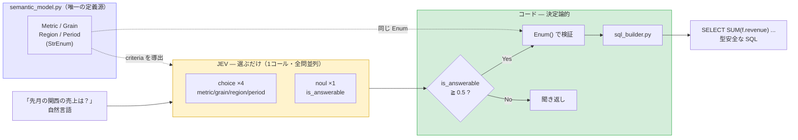
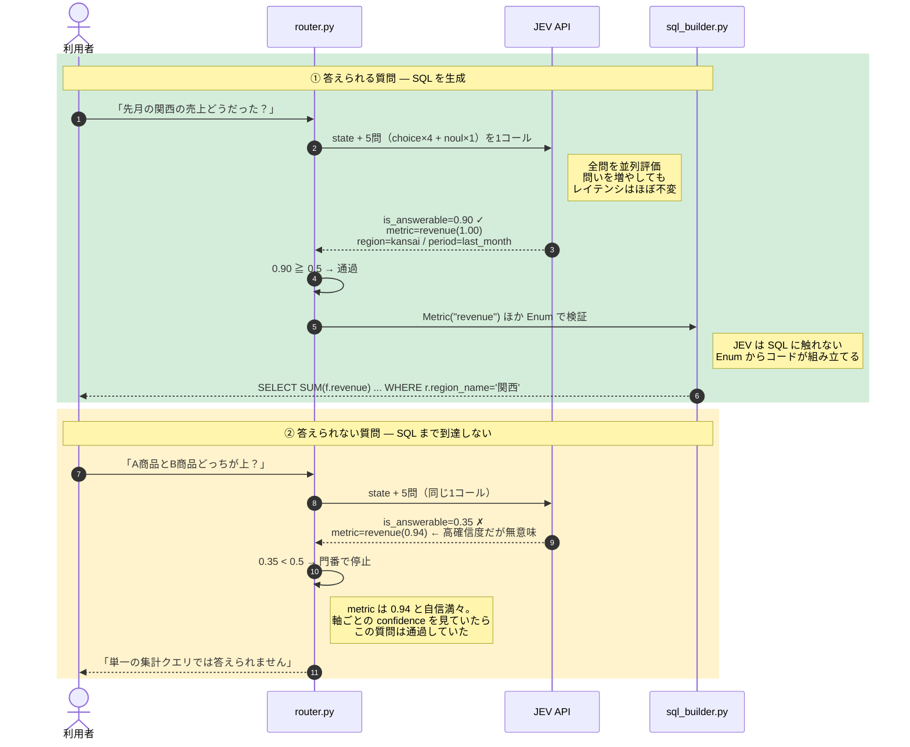

# JEV 擬似セマンティックレイヤー（spike）

「[JEV](https://typesafe.ai/) を使って擬似的なセマンティックレイヤーを作れるか」を
実 API で検証した spike。

## 答え

**作れる。ただし作れるのは「意味の解決層」だけで、そこが実は一番難しかった部分。**

| 層 | JEV の可否 | 実測 |
|---|---|---|
| 曖昧な自然言語 → 確定した意味 | ✅ 得意 | 7/7 正解・平均 285ms |
| 答えられない質問の検出 | ✅ 得意 | 矛盾・予測・比較を全て検出 |
| SQL / YAML の生成 | ❌ 原理的に不可 | JEV は文字列を返さない |

JEV の出力は `choice` / `score` / `noul` の3つだけで、raw string を一切生成しない。
そのため SQL は JEV に書かせず、**解決済みの Enum からコードが決定論的に組み立てる**。
JEV は「選ぶ」だけ、SQL の生成には一切関与しない。

## 設計



**この図が示していること:**

- **黄色（JEV）は選ぶだけで、SQL には一切触れない。** JEV は raw string を生成しないので、
  文字列を作る仕事は構造的に任せられない。
- **`semantic_model.py` から2本の点線が出ている**のが要。JEV へ渡す criteria と、
  SQL 組み立て時の検証が**同じ Enum から導出される**ので、
  「JEV が選べる値」と「SQL が組み立てられる値」がズレようがない。
  セマンティックレイヤーの定義（＝答えの選択肢を有限集合として事前に宣言する）と、
  JEV が要求する `criteria` の形が一致するため、この対応付けが成立する。
- **`is_answerable` が唯一の門番。** 軸ごとの confidence は判定に使わない
  （理由は次節）。矛盾した質問はここで止まり、SQL 組み立てまで到達しない。
- 不正な値は `Enum()` で例外になるため、**不正な SQL は生成されるのではなく到達不能**。

## 利用シーンでの挙動

同じ経路を通るのに、**どこで道が分かれるか**が2つのパスの違い。



**この図が示していること:**

- **2つのパスは JEV への問い合わせまで完全に同一。** 質問の種類を事前に振り分ける
  前処理は無く、分岐は `is_answerable` を受け取った後の1箇所だけ。
- **②で `metric=revenue(0.94)` が返っている**のが重要。JEV は「A商品とB商品の比較」に
  対しても revenue を高確信度で選ぶ。軸ごとの confidence で判定していたら
  **この質問は通過し、意味のない SQL が生成されていた**。
- **②は `sql_builder.py` に到達しない。** 不正な SQL を作ってから検証するのではなく、
  そもそも組み立てフェーズまで行かせない。
- 実測平均 **285ms**（7ケース）、入力約1,100トークン/クエリ、出力は課金対象外。
  ②のように早期に止まるパスは、SQL 組み立てを行わない分さらに短い。

## 実測で分かったこと

**判定に使えるのは `is_answerable` (noul) ただ1つだった。**

軸ごとの `confidence` は、聞き返すべき質問に対しても 0.90〜1.00 を返す。
JEV は「曖昧さ」ではなく「尤度」を返すため、手がかりが皆無でも
最も尤もらしい選択肢を自信を持って選ぶ。

| 質問 | answerable | metric conf | 正解 |
|---|---|---|---|
| 先月の関西の売上どうだった？ | 0.88 | 1.00 | SQL |
| 今月の平均単価を日別で | 0.82 | 1.00 | SQL |
| A商品とB商品どっちが上？ | 0.35 | 0.96 ← 高い | clarify |
| 売れ行きは？ | 0.32 | 0.90 ← 高い | clarify |
| 関東の注文件数を四半期ごとに、直近1週間で | 0.24 | 1.00 ← 高い | clarify |
| 来月の売上いくらになりそう？ | 0.05 | 1.00 ← 高い | clarify |
| 最近調子どう？ | 0.04 | 0.66 | clarify |

最も示唆的なのは **「関東の注文件数を四半期ごとに、直近1週間で」**。
四半期粒度と7日間という矛盾を含むが、軸ごとに見れば metric=1.00 / period=0.96 と
すべて正しい。**組み合わせとしての破綻は軸単位の confidence では原理的に検出できず**、
noul だけがこれを捉えた（0.24）。

この設計の成否は `is_answerable` の instructions 文言にほぼ全て懸かっており、
そこが単一障害点でもある。

## 使い方

```bash
cp .env.example .env     # TYPESAFE_API_KEY に値を入れる
uv venv && uv pip install typesafe-sdk python-dotenv
.venv/bin/python -m jev_semantic_layer.run_spike
```

## コスト

7ケースで入力 7,772 トークン、出力は課金対象外。
1クエリあたり約 1,100 トークンで、その大半は criteria の説明文。
説明文を厚くすると精度が上がるがコストも上がる、という trade-off が直接現れる。

## 構成

| ファイル | 役割 |
|---|---|
| `semantic_model.py` | Enum + criteria 説明文。唯一の定義源 |
| `jev_client.py` | 公式 SDK のラッパ。レイテンシ/トークンを計測 |
| `router.py` | is_answerable による判定 |
| `sql_builder.py` | Enum → SQL（JEV は関与しない） |
| `test_cases.py` | 7ケース。曖昧な質問が本命 |
| `run_spike.py` | 実行エントリ |

## 未検証

- `score` プリミティブは未使用（今回は不要だった）
- 軸を増やしたとき（product 次元など）に is_answerable の精度が保たれるか
- criteria 説明文を削ったときに精度がどこまで落ちるか（コスト最適化の余地）
