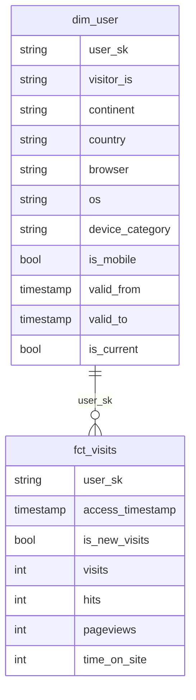

```mermaid
erDiagram
    dim_user ||--o{ fct_visits : user_sk
    dim_user {
        string user_sk
        string visitor_is
        string continent
        string country
        string browser
        string os
        string device_category
        bool is_mobile
        timestamp valid_from
        timestamp valid_to
        bool is_current
    }

    fct_visits {
        string user_sk
        timestamp access_timestamp
        bool is_new_visits
        int visits
        int hits
        int pageviews
        int time_on_site
    }
```