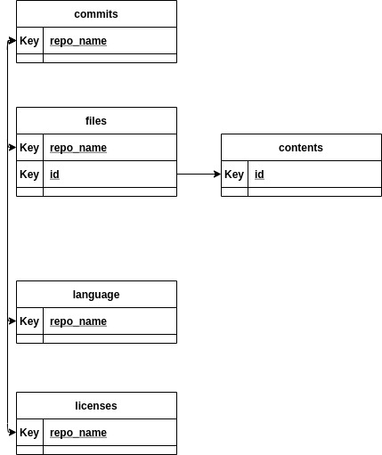

# github repo datasetについて
BQのパブリックデータとしてgithubのオープンリポジトリのコミットやライセンスのログがパブリックデータセットとして公開されています。このデータセットを用いればgithubのトレンド分析やライブラリ流行り廃り、各言語の利用度合いを分析することができます。

## 各テーブルについて
| Name | Overview | Columnes | Records | Size |
| --- | --- | --- | --- | --- |
| commits | コミット情報がまとまっている | 31 | 254,228,926 | 818.84 GB
| contents |　リポジトリに存在する各ファイルの中身を格納している | 5 | 273,626,689 | 2.38TB |
| files | リポジトリそこに格納されるファイルパスを格納している | 6 | 2,306,714,569| 320.7 GB
| languages |　各リポジトリが使っている言語がまとまっている | 4 | 3,332,049 | 194.92 MB |
| licenses | 各リポジトリのライセンスがまとまっている | 2 | 3,332,049 | 103.4 MB |
| sample_commits | | 31 | 672,309 | 2.49 GB
| sample_contents | | 5 | 2,905,870 | 24.04 GB
| sample_files | | 6 | 72,879,442 | 9.99 GB |
| sample_repos | | 2 | 400,000 | 12.52 MB |

注意点
- contentsは約2.4TBの容量を持っているためテスト用のSQLを作りたい場合はsample_contentsが容量が小さい(24GB程度)のでおすすめ
- その他のオリジナルのデータセットの容量も大きいため分析構想段階ではsampleとプレフィックスの付いているものを使うことをおすすめ

## データリレーション

上図のようにrepo_nameで基本的につながっておりcontentsのみfilesのidとつながっています。

# 分析アイデア
- filesのpathからファイルの拡張子が取得できるため拡張子毎のファイル数の統計が取れる
- filesのidとcontentのidで特定の言語のファイル内容を取得できる
- リポジトリトレンド
  - コミットが新しくかつ数の多いもの
  - 日単位
  - 週単位
  - 月単位
  - 年単位
- リポジトリトレンドと開発言語のタグつけを行う
- 頻出ライブラリ
  - ファイル内容分析
    - 呼び出されているライブラリ名を取得できる
- 各ファイルのタブ、スペースをカウント

# 作るもの
## 第一弾
- リポジトリのコミット数、直近更新日時
- リポジトリの更新インターバル
- リポジトリの占有率Top3の言語を抽出する
- ファイルで呼び出されるライブラリを抽出する
- ファイル内に含まれるスペースとタブの割合を抽出

# 参考
- [All the open source code in GitHub now shared within BigQuery: Analyze all the code!](https://hoffa.medium.com/github-on-bigquery-analyze-all-the-code-b3576fd2b150)
- [Analyzing Go code with BigQuery](https://medium.com/google-cloud/analyzing-go-code-with-bigquery-485c70c3b451#.glhi7lrl4)    